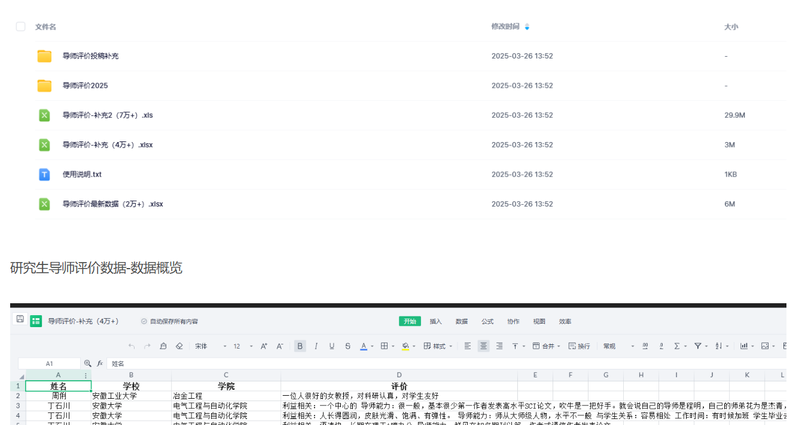

# Instrumental Variables - The latest dataset on graduate mentor evaluations in 2025

327MB
The data collection covers the evaluation of domestic and foreign university professors, including their teaching experience, research achievements, and teaching methods. The aim is to provide students with comprehensive information about their potential supervisors, helping them make informed decisions on selecting a suitable mentor for their research project.

The data includes the public information of mentors, student submission reviews, user comprehensive feedback, and emotional scoring, with more than 100,000 samples. I hope it will be helpful to everyone.

I. Data Introduction
Data Name: Graduate Advisor Evaluation Data
Data Range: University in China, a few foreign universities' advisors
Sample Number: More than 100,000
Data Source: Selecting good advisors, Advisor Evaluation Network, etc.
Update Time: March 2025

Two. Data Overview
Graduate Supervisor Evaluation Data - Data File
## Images

Here is a pay link on Stripe ( https://buy.stripe.com/3cs8yP7sY87d0vu9AB ). Please contact me lonlonago@foxmail.com after funding $89, and I will send you a complete data files , thank you!

